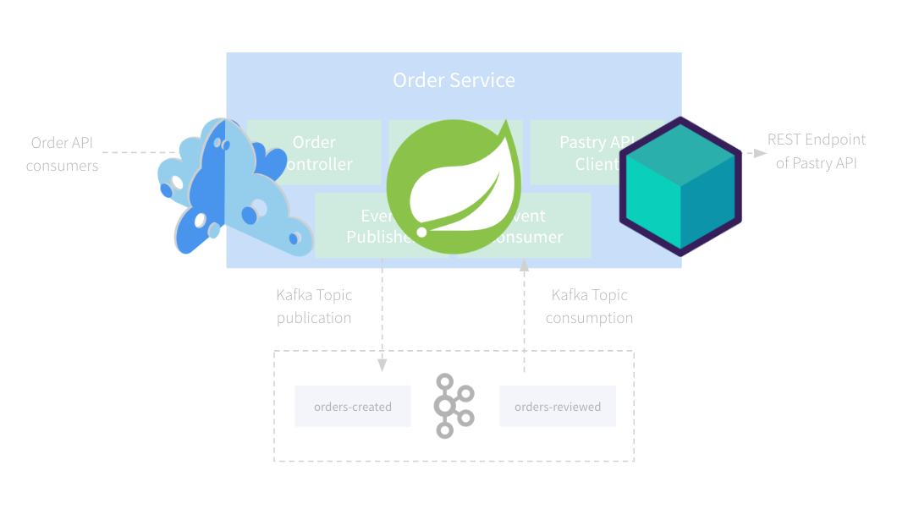

# Microcks Testcontainers Spring Boot Demo

This application is a demonstration on how to integrate Microcks via [Testcontainers]([https://www.testcontainers.com]) within your development inner-loop.

You will work with a Spring Boot application and explore how to:
* Use Microcks for provisioning third-party API mocks,
* Use Microcks for simulating external Kafka events publishers,
* Write tests using Microcks contract-testing features for both REST/OpenAPI based APIs and Events/AsyncAPI based messaging

## Table of contents

* [Step 1: Getting Started](step-1-getting-started.md)
* [Step 2: Exploring the app](step-2-exploring-the-app.md)
* [Step 3: Local Development Experience with Microcks](step-3-local-development-experience.md)
* [Step 4: Write Tests for REST](step-4-write-rest-tests.md)
* [Step 5: Write Tests for Async](step-5-write-async-tests.md)

## License Summary

The code in this repository is made available under the MIT license. See the [LICENSE](LICENSE) file for details.
