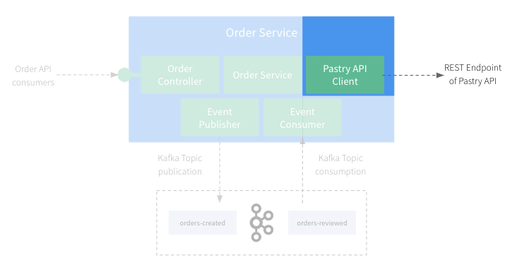
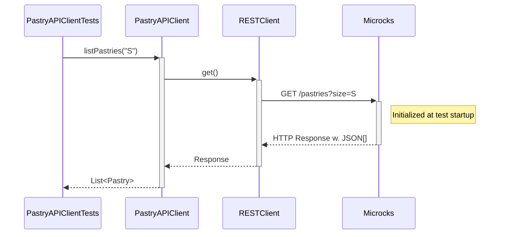
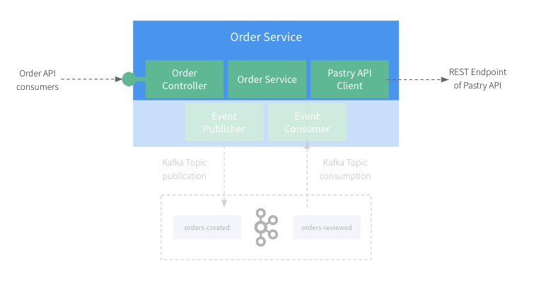
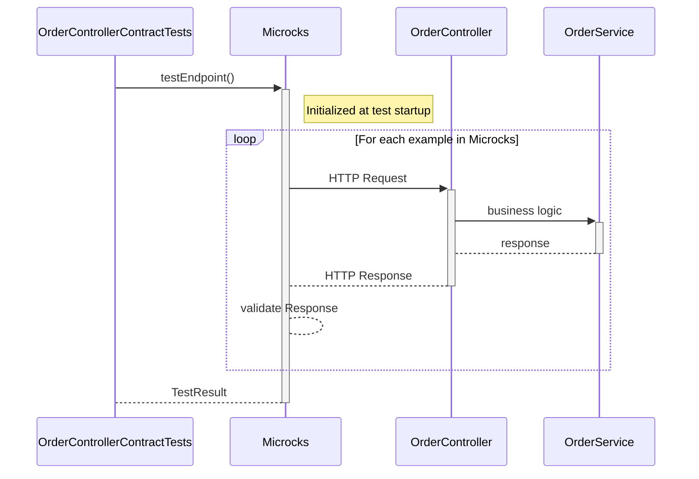

# Step 4: Let's write tests for the REST APIs

So far, we focused on being able to run the application locally without having to install or run any dependent services manually.
But there is nothing more painful than working on a codebase without a comprehensive test suite.

Let's fix that!!

## Common Test SetUp

For all the integration tests in our application, we need to start Kafka and use mocks provided by Microcks containers.
So, let's create a `BaseIntegrationTest` class under `src/test/java/org/acme/order` with the common setup as follows:

```java
package org.acme.order;

import io.github.microcks.testcontainers.MicrocksContainersEnsemble;

import org.junit.jupiter.api.BeforeEach;
import org.springframework.beans.factory.annotation.Autowired;
import org.springframework.boot.test.context.SpringBootTest;
import org.springframework.boot.test.web.server.LocalServerPort;
import org.springframework.context.annotation.Import;
import org.testcontainers.Testcontainers;

@SpringBootTest(webEnvironment = SpringBootTest.WebEnvironment.RANDOM_PORT)
@Import(ContainersConfiguration.class)
public abstract class BaseIntegrationTest {

   @Autowired
   protected MicrocksContainersEnsemble microcksEnsemble;

   @LocalServerPort
   protected Integer port;

   @BeforeEach
   void setupPort() {
      // Host port exposition should be done here.
      Testcontainers.exposeHostPorts(port);
   }
}
```

* We have reused the `ContainersConfiguration` class that we created in the previous steps to define all the required containers.
* We have configured the Spring Boot application with a `WebEnvironment.RANDOM_PORT` to avoid conflicts or collisions.
* We have exposed this port via `Testcontainers.exposeHostPorts()` so that it can be reached by our Testcontainers.

## First Test - Verify our RESTClient

In this section, we'll focus on testing the `Pastry API Client` component of our application:



Let's review the test class `PastryAPIClientTests` under `src/test/java/org/acme/order/client`:

```java
public class PastryAPIClientTests extends BaseIntegrationTest {

   @Autowired
   PastryAPIClient client;

   @Test
   public void testGetPastries() {
      // Test our API client and check that arguments and responses are correctly serialized.
      List<Pastry> pastries = client.listPastries("S");
      assertEquals(1, pastries.size());

      pastries = client.listPastries("M");
      assertEquals(2, pastries.size());

      pastries = client.listPastries("L");
      assertEquals(2, pastries.size());
   }

   @Test
   public void testGetPastry() {
      // Test our API client and check that arguments and responses are correctly serialized.
      Pastry pastry = client.getPastry("Millefeuille");
      assertEquals("Millefeuille", pastry.name());
      assertEquals("available", pastry.status());

      pastry = client.getPastry("Eclair Cafe");
      assertEquals("Eclair Cafe", pastry.name());
      assertEquals("available", pastry.status());

      pastry = client.getPastry("Eclair Chocolat");
      assertEquals("Eclair Chocolat", pastry.name());
      assertEquals("unknown", pastry.status());
   }
}
```

If you run this test, it should pass and that means we have successfully configured the application to start with all the required containers
and that they're correctly wired to the application. Within this test:
* We're reusing the data that comes from the examples in the `Pastry API` OpenAPI specification and Postman collection.
* The `PastryAPIClient` has been configured with a REST Client that is wired to the Microcks mock endpoints.
* We're validating the configuration of this client as well as all the JSON and network serialization details of our configuration!  

The sequence diagram below details the test sequence. Microcks is used as a third-party backend to allow going through all the layers:



### Bonus step - Check the mock endpoints are actually used

While the above test is a good start, it doesn't actually check that the mock endpoints are being used. In a more complex application, it's possible
that the client is not correctly configured or use some cache or other mechanism that would bypass the mock endpoints. In order to check that you
can actually use the `verify()` method available on the Microcks container:

```java
@Test
public void testGetPastries() {
   // Test our API client and check that arguments and responses are correctly serialized.
   List<Pastry> pastries = client.listPastries("S");
   assertEquals(1, pastries.size());

   pastries = client.listPastries("M");
   assertEquals(2, pastries.size());

   pastries = client.listPastries("L");
   assertEquals(2, pastries.size());

  // Check that the mock API has really been invoked.
  boolean mockInvoked = microcksEnsemble.getMicrocksContainer().verify("API Pastries", "0.0.1");
  assertTrue(mockInvoked, "Mock API not invoked");
}
```

`verify()` takes the target API name and version as arguments and returns a boolean indicating if the mock has been invoked. This is a good way to
ensure that the mock endpoints are actually being used in your test.

If you need finer-grained control, you can also check the number of invocations with `getServiceInvocationsCount()`. This way you can check that
the mock has been invoked the correct number of times:

```java
@Test
void testGetPastry() {
   // Get the number of invocations before our test.
   long beforeMockInvocations = microcksEnsemble.getMicrocksContainer().getServiceInvocationsCount("API Pastries", "0.0.1");

   // Test our API client and check that arguments and responses are correctly serialized.
   Pastry pastry = client.getPastry("Millefeuille");
   assertEquals("Millefeuille", pastry.name());
   assertEquals("available", pastry.status());

   pastry = client.getPastry("Eclair Cafe");
   assertEquals("Eclair Cafe", pastry.name());
   assertEquals("available", pastry.status());

   pastry = client.getPastry("Eclair Chocolat");
   assertEquals("Eclair Chocolat", pastry.name());
   assertEquals("unknown", pastry.status());

   // Check our mock API has been invoked the correct number of times.
   long afterMockInvocations = microcksEnsemble.getMicrocksContainer().getServiceInvocationsCount("API Pastries", "0.0.1");
   assertEquals(3, afterMockInvocations - beforeMockInvocations, "Mock API not invoked the correct number of times");
}
```

## Second Test - Verify the technical conformance of Order Service API

The 2nd thing we want to validate is the conformance of the `Order API` we'll expose to consumers. In this section and the next one,
we'll focus on testing the `OrderController` component of our application:



We certainly can write an integration test that uses [Rest Assured](https://rest-assured.io/) or other libraries
to invoke the exposed HTTP layer and validate each and every response with Java assertions like:

```java
when()
   .get("/lotto/{id}", 5)
.then()
   .statusCode(200)
   .body("lotto.lottoId", equalTo(5),
      "lotto.winners.winnerId", hasItems(23, 54));
```

This certainly works but presents 2 problems in my humble opinion:
* It's a lot of code to write! And it's apply to each API interaction because for each interaction it's probably a good idea to
  check the structure of same objects in the message. This lead to a fair amount of code!
* The code you write here is actually a language specific translation of the OpenAPI specification for the `Order API`: so the same
  "rules" get duplicated. Whether you edit the code or the OpenAPI spec first, high are the chances you get some drifts between your test
  suite and the specification you will provide to consumers!

Microcks Testcontainer integration provides another approach by letting you reuse the OpenAPI specification directly in your test suite,
without having to write assertions and validation of messages for API interaction.

Let's review the test class `OrderControllerContractTests` under `src/test/java/org/acme/order/api`:

```java
public class OrderControllerContractTests extends BaseIntegrationTest {

   @Test
   public void testOpenAPIContract() throws Exception {
      // Ask for an Open API conformance to be launched.
      TestRequest testRequest = new TestRequest.Builder()
            .serviceId("Order Service API:0.1.0")
            .runnerType(TestRunnerType.OPEN_API_SCHEMA.name())
            .testEndpoint("http://host.testcontainers.internal:" + port + "/api")
            .build();

      TestResult testResult = microcksEnsemble.getMicrocksContainer().testEndpoint(testRequest);

      assertTrue(testResult.isSuccess());
      assertEquals(1, testResult.getTestCaseResults().size());
   }
}
```

Here, we're using a Microcks-provided `TestRequest` object that allows us to specify to Microcks the scope of the conformance
test we want to run:
* We ask for testing our endpoint against the service interface of `Order Service API` in version `0.1.0`.
  These are the identifiers found in the `order-service-openapi.yaml` file.
* We ask Microcks to validate the `OpenAPI Schema` conformance by specifying a `runnerType`.
* We ask Microcks to validate the localhost endpoint on the dynamic port provided by the Spring Test (we use the `host.testcontainers.internal` alias for that).

Finally, we're retrieving a `TestResult` from Microcks containers, and we can assert stuffs on this result, checking it's a success.

The sequence diagram below details the test sequence. Microcks is used as a middleman that actually invokes your API with the example from its dataset: 



Our `OrderController` development is technically correct: all the JSON and HTTP serialization layers have been tested!

## Third Test - Verify the business conformance of Order Service API

The above section allows us to validate the technical conformance but not the business one! Imagine we forgot to record all the
requested products in the order or change the total price in resulting order. This could raise some issues!

Microcks allows to execute business conformance test by leveraging Postman Collection. If you're familiar with Postman Collection
scripts, you'll open the `order-service-postman-collection.json` file and find some snippets like:

```jshelllanguage
pm.test("Correct products and quantities in order", function () {
    var order = pm.response.json();
    var productQuantities = order.productQuantities;
    pm.expect(productQuantities).to.be.an("array");
    pm.expect(productQuantities.length).to.eql(requestProductQuantities.length);
    for (let i=0; i<requestProductQuantities.length; i++) {
        var productQuantity = productQuantities[i];
        var requestProductQuantity = requestProductQuantities[i];
        pm.expect(productQuantity.productName).to.eql(requestProductQuantity.productName);
    }
});
```

This snippet typically describes business constraints telling that a valid order response should have unchanged product and quantities.  

You can now validate this from your Java Unit Test as well! Let's review the test class `OrderControllerPostmanContractTests` 
under `src/test/java/org/acme/order/api`:

```java
public class OrderControllerPostmanContractTests extends BaseIntegrationTest {

   @Test
   public void testPostmanCollectionContract() throws Exception {
      // Ask for a Postman Collection script conformance to be launched.
      TestRequest testRequest = new TestRequest.Builder()
            .serviceId("Order Service API:0.1.0")
            .runnerType(TestRunnerType.POSTMAN.name())
            .testEndpoint("http://host.testcontainers.internal:" + port + "/api")
            .build();

      TestResult testResult = microcksEnsemble.getMicrocksContainer().testEndpoint(testRequest);

      assertTrue(testResult.isSuccess());
      assertEquals(1, testResult.getTestCaseResults().size());
   }
}
```

Comparing to the code in previous section, the only change here is that we asked Microcks to use a `Postman` runner
for executing our conformance test. What happens under the hood is now that Microcks is re-using the collection snippets
to put some constraints on API response and check their conformance.

The test sequence is exactly the same as in the previous section. The difference here lies in the type of response validation: Microcks
reuses Postman collection constraints.

You're now sure that beyond the technical conformance, the `Order Service` also behaves as expected regarding business 
constraints. 

### Bonus step - Verify the business conformance of Order Service API in pure Java

Even if the Postman Collection runner is a great way to validate business conformance, you may want to do it in pure Java.
This is possible by retrieving the messages exchanged during the test and checking their content. Let's review the `testOpenAPIContractAndBusinessConformance()`
test in class `OrderControllerContractTests` under `src/test/java/org/acme/order/api`:

```java
@Test
void testOpenAPIContractAndBusinessConformance() throws Exception {
   // Ask for an Open API conformance to be launched.
   TestRequest testRequest = new TestRequest.Builder()
         .serviceId("Order Service API:0.1.0")
         .runnerType(TestRunnerType.OPEN_API_SCHEMA.name())
         .testEndpoint("http://host.testcontainers.internal:" + port + "/api")
         .build();

   TestResult testResult = microcksEnsemble.getMicrocksContainer().testEndpoint(testRequest);

   assertTrue(testResult.isSuccess());
   assertEquals(1, testResult.getTestCaseResults().size());

   // You may also check business conformance.
   List<RequestResponsePair> pairs = microcksEnsemble.getMicrocksContainer().getMessagesForTestCase(testResult, "POST /orders");
   for (RequestResponsePair pair : pairs) {
      if ("201".equals(pair.getResponse().getStatus())) {
         Map<String, Object> requestMap = mapper.readValue(pair.getRequest().getContent(), new TypeReference<>() {});
         Map<String, Object> responseMap = mapper.readValue(pair.getResponse().getContent(), new TypeReference<>() {});

         List<Map<String, Object>> requestPQ = (List<Map<String, Object>>) requestMap.get("productQuantities");
         List<Map<String, Object>> responsePQ = (List<Map<String, Object>>) responseMap.get("productQuantities");

         assertEquals(requestPQ.size(), responsePQ.size());
         for (int i = 0; i < requestPQ.size(); i++) {
            assertEquals(requestPQ.get(i).get("productName"), responsePQ.get(i).get("productName"));
         }
      }
   }
}
```

This test is a bit more complex than the previous ones. It first asks for an OpenAPI conformance test to be launched and then retrieves the messages
to check business conformance, following the same logic that was implemented into the Postman Collection snippet.

It uses the `getMessagesForTestCase()` method to retrieve the messages exchanged during the test and then checks the content. While this is done
in pure Java here, you may use the tool or library of your choice like [JSONassert](https://github.com/skyscreamer/JSONassert),
[AssertJ](https://assertj.github.io/doc/), [Cucumber](https://cucumber.io/docs/installation/java/) or others.


### 
[Next](step-5-write-async-tests.md)