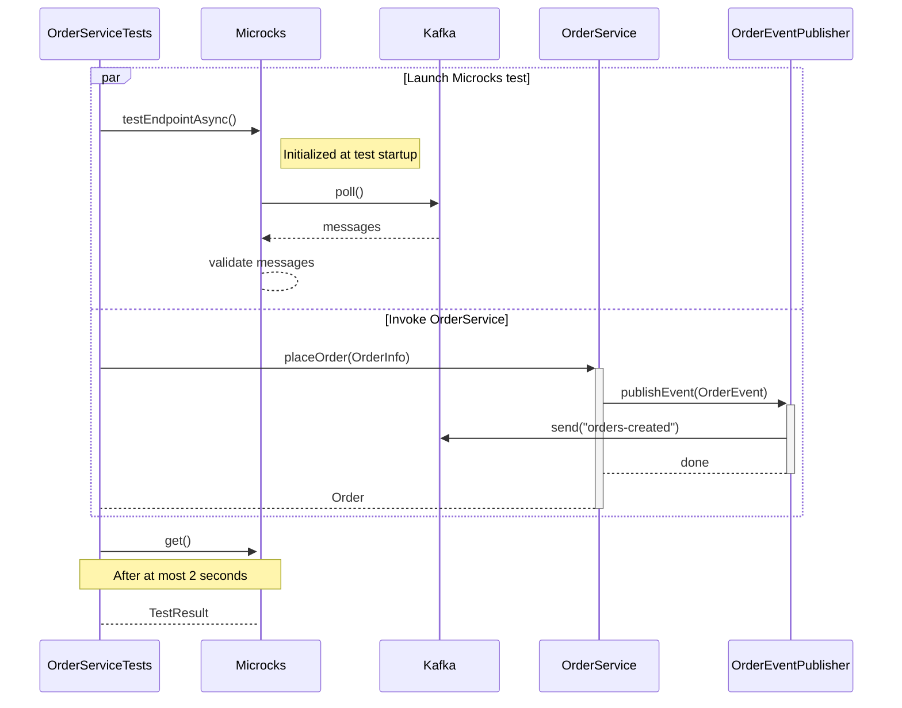
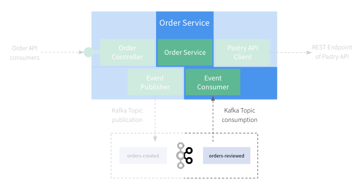
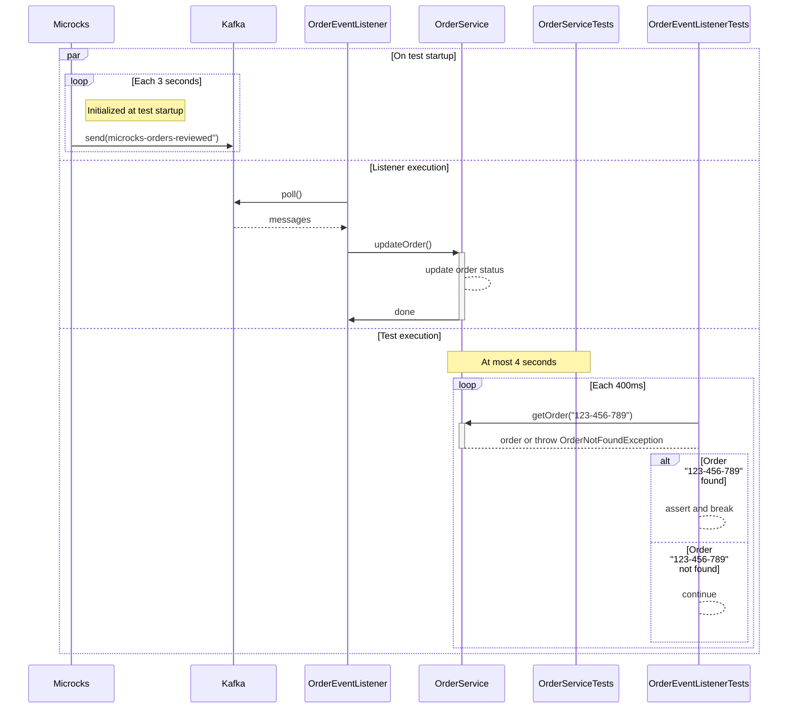

# Step 5: Let's write tests for the Async Events

Now that we address the REST/Synchronous part, let's have a look on the part related to Asynchronous Kafka events.
Testing of asynchronous or event-driven system is usually a pain for developers 🥲

## First Test - Verify our OrderService is publishing events

In this section, we'll focus on testing the `Event Publisher` component of our application:


Even if it may be easy to check that the creation of an event object has been triggered with frameworks like [Mockito](https://site.mockito.org/)
or others, it's far more complicated to check that this event is correctly serialized, sent to a broker and valid
regarding an Event definition...

Fortunately, Microcks and TestContainers make this thing easy!

Let's review the test class `OrderServiceTests` under `src/test/java/org/acme/order/service` and the well-named `testEventIsPublishedWhenOrderIsCreated()` 
method:

```java
public class OrderServiceTests extends BaseIntegrationTest {

   @Autowired
   KafkaContainer kafkaContainer;

   @Autowired
   OrderService service;

   @Test
   public void testEventIsPublishedWhenOrderIsCreated() {
      ensureTopicExists("orders-created");

      // Prepare a Microcks test.
      TestRequest kafkaTest = new TestRequest.Builder()
            .serviceId("Order Events API:0.1.0")
            .filteredOperations(List.of("SUBSCRIBE orders-created"))
            .runnerType(TestRunnerType.ASYNC_API_SCHEMA.name())
            .testEndpoint("kafka://kafka:19092/orders-created")
            .timeout(2000l)
            .build();

      // Prepare an application Order.
      OrderInfo info = new OrderInfo("123-456-789", List.of(
            new ProductQuantity("Millefeuille", 1),
            new ProductQuantity("Paris-Brest", 1)
      ), 8.4);

      try {
         // Launch the Microcks test and wait a bit to be sure it actually connects to Kafka.
         CompletableFuture<TestResult> testRequestFuture = microcksEnsemble.getMicrocksContainer().testEndpointAsync(kafkaTest);
         await().pollDelay(750, TimeUnit.MILLISECONDS).untilAsserted(() -> assertTrue(true));

         // Invoke the application to create an order.
         Order createdOrder = service.placeOrder(info);

         // You may check additional stuff on createdOrder...

         // Get the Microcks test result.
         TestResult testResult = testRequestFuture.get();

         // Check success and that we read 1 valid message on the topic.
         assertTrue(testResult.isSuccess());
         assertFalse(testResult.getTestCaseResults().isEmpty());
         assertEquals(1, testResult.getTestCaseResults().get(0).getTestStepResults().size());
      } catch (Exception e) {
         fail("No exception should be thrown when testing Kafka publication", e);
      }
   }

   [...]
}
```

Things are a bit more complex here, but we'll walk through step-by-step:
* Similarly to previous section, we prepared a Microcks-provided `TestRequest` object
  * We ask for a `AsyncAPI Schema` conformance test that will use the definition found into the `order-events-asyncapi.yaml` contract,
  * We ask Microcks to listen to the `kafka://kafka:19092/orders-created` endpoint that represents the `orders-created` topic on our Kafka broker managed by Testcontainers,
  * We ask to focus on a specific operation definition to mimic consumers that subscribe to the  `orders-created` channel,
  * We specified a timeout value that means that Microcks will only listen during 2 seconds for incoming messages. 
* We also prepared an `OrderInfo` object that will be used as the input of the `placeOrder()` method invocation on `OrderService`.
* Then, we launched the test on the Microcks side. This time, the launch is asynchronous, so we received a `Future` that will give us a `TestResult` later on
  * We wait a bit here to ensure, Microcks got some time to start the test and connect to Kafka broker.
* We can invoke our business service by creating an order with `placeOrder()` method. We could assert whatever we want on created order as well.
* Finally, we wait for the future completion to retrieve the `TestResult` and assert on the success and check we received 1 message as a result.

The sequence diagram below details the test sequence. You'll see 2 parallel blocks being executed:
* One that corresponds to Microcks test - where it connects and listen for Kafka messages,
* One that corresponds to the `OrderService` invokation that is expected to trigger a message on Kafka.



Because the test is a success, it means that Microcks has received an `OrderEvent` on the specified topic and has validated the message
conformance with the AsyncAPI contract or this event-driven architecture. So you're sure that all your Spring Boot configuration, Kafka JSON serializer
configuration and network communication are actually correct!

## Second Test - Verify our OrderEventListener is processing events

In this section, we'll focus on testing the `Event Consumer` component of our application:



The final thing we want to test here is that our `OrderEventListener` component is actually correctly configured for connecting to Kafka,
for consuming messages, for de-serializing them into correct Java objects and for triggering the processing on the `OrderService`.
That's a lot to do and can be quite complex! But things remain very simple with Microcks 😉

Let's review the test class `OrderEventListenerTests` under `src/test/java/org/acme/order/service` and the well-named `testEventIsConsumedAndProcessedByService()`
method:

```java
public class OrderEventListenerTests extends BaseIntegrationTest {

   @Autowired
   OrderService service;

   @Test
   public void testEventIsConsumedAndProcessedByService() throws Exception {
      try {
         await().atMost(4, TimeUnit.SECONDS)
               .pollDelay(400, TimeUnit.MILLISECONDS)
               .pollInterval(400, TimeUnit.MILLISECONDS)
               .until(() -> {
                  try {
                     Order order = service.getOrder("123-456-789");
                     assertEquals("lbroudoux", order.getCustomerId());
                     assertEquals(OrderStatus.VALIDATED, order.getStatus());
                     assertEquals(2, order.getProductQuantities().size());
                     return true;
                  } catch (OrderNotFoundException onfe) {
                     // Continue until ConditionTimeoutException.
                  }
                  return false;
               });
      } catch (ConditionTimeoutException timeoutException) {
         fail("The expected Order was not received/processed in expected delay");
      }
   }
}
```

To fully understand this test, remember that as soon as you're launching the test, we start Kafka and Microcks containers and that Microcks
is immediately starting publishing mock messages on this broker. So this test actually starts with a waiting loop, just checking that the
messages produced by Microcks are correctly received and processed on the application side.

The important things to get in this test are:
* We're waiting at most 4 seconds here because the default publication frequency of Microcks mocks is 3 seconds (this can be configured as you want of course),
* Within each polling iteration, we're checking for the order with id `123-456-789` because these are the values defined within the `order-events-asyncapi.yaml` AsyncAPI contract examples
* If we retrieve this order and get the correct information from the service, it means that is has been received and correctly processed!
* If no message is found before the end of 4 seconds, the loop exits with a `ConditionTimeoutException` and we mark our test as failed.

The sequence diagram below details the test sequence. You'll see 3 parallel blocks being executed:
* The first corresponds to Microcks mocks - where it connects to Kafka, creates a topic and publishes sample messages each 3 seconds,
* The second one corresponds to the `ORderEventListener` invocation that should be triggered when a message is found in the topic,
* The third one corresponds to the actual test - where we check that the specified order has been found and processed by the `OrderService`. 



You did it and succeed in writing integration tests for all your application component with minimum boilerplate code! 🤩 

## Wrap-up

Thanks a lot for being through this quite long demonstration. We hope you learned new techniques for integration tests with both REST and Async/Event-driven APIs. Cheers! 🍻